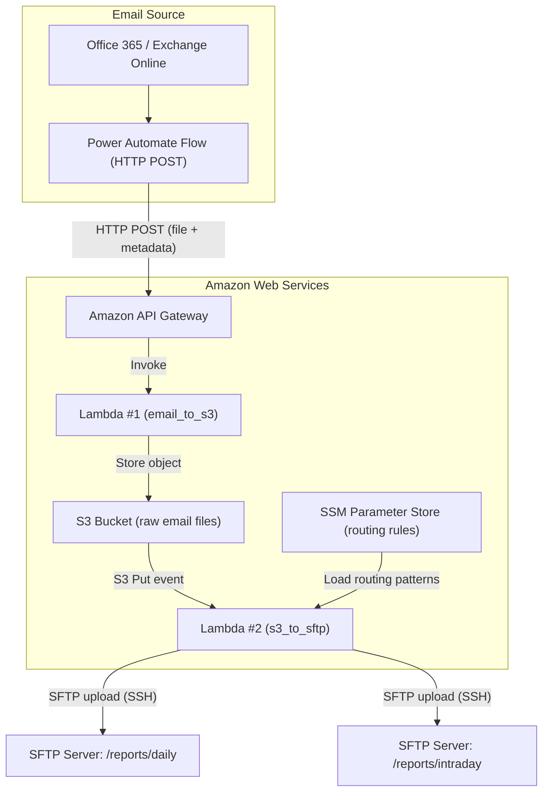

AWS Email-to-SFTP Pipeline

Pipeline that extracts email attachments from Office 365, sends them to AWS (API Gateway → Lambda → S3), and uses S3 events to trigger a second Lambda that delivers files to SFTP destinations.

## Power Automate flow

The email ingestion logic is implemented in a Power Automate flow that:

- Watches a dedicated Office 365 mailbox
- Filters emails and attachments based on business rules
- Sends each attachment to API Gateway via HTTP POST (binary body + metadata)

For the detailed flow diagram and step-by-step breakdown, see:  
[Power Automate flow overview](power-automate/flow-overview.md)

Key features:

 - Power Automate → API Gateway binary HTTP integration
 - Lambda ingestion with S3 storage and SSE encryption
 - Event-driven S3 → SFTP transfer
 - Routing rules stored in SSM (regex-based, multi-destination)
 - Streaming S3-to-SFTP (no full file load)
 - Cross-platform automation (Microsoft 365 → AWS → SFTP)

Tech stack: Power Automate, AWS API Gateway, AWS Lambda, S3, SSM Parameter Store, Python, Paramiko, SFTP
