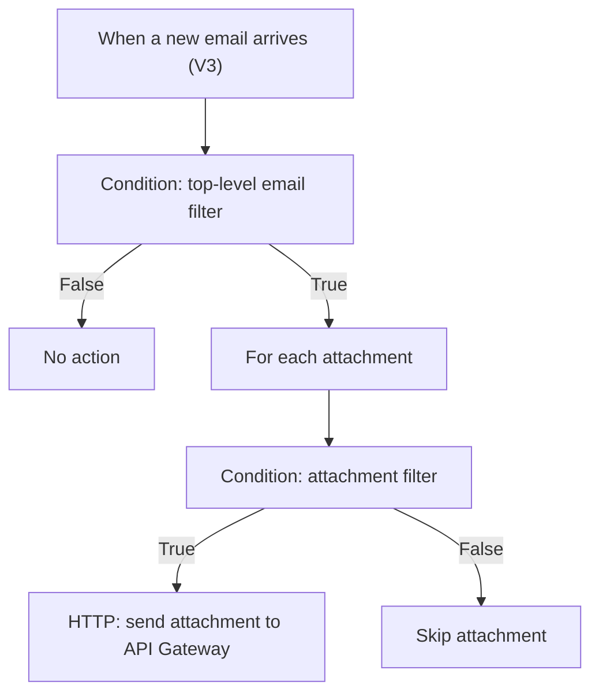

Power Automate Flow Overview

This flow monitors a dedicated Office 365 mailbox, filters relevant emails, extracts attachments, and sends them to AWS API Gateway as binary HTTP requests.

Key steps:
 - Trigger on new email in a specific mailbox/folder
 - Exclude messages using subject filters
 - Validate sender domain
 - Loop through attachments
 - Process only filenames matching specific patterns
 - Convert attachment content to binary
 - Send POST request to AWS API Gateway with:
   - x-filename
   - x-api-key
   - binary body
 - Send alert email if AWS responds with an error

Purpose:
 - Automates secure delivery of selected attachments into AWS
 - Fully replaces manual mailbox checks
 - Works as the first step of the AWS → S3 → SFTP pipeline

